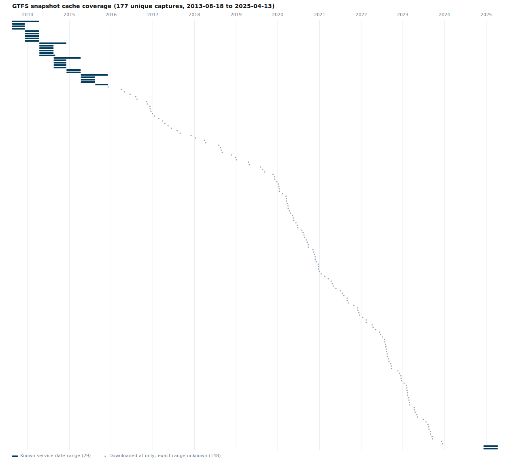

# GTFS vs TDM

Compares the base-year transit network in the Wasatch Front regional travel demand model (TDM) against published GTFS transit data, to check that the two are consistent with each other.

## Background

The regional travel demand model represents transit service (routes, stops, and line-haul network) for a defined base year. GTFS (General Transit Feed Specification) feeds published by the region's transit agency describe the same service as actually operated. This repo brings both datasets into an R + [mapgl](https://walker-data.com/mapgl/) (MapLibre GL JS) Shiny app so route alignment and coverage differences can be inspected visually.

Comparison here is **visual validation**, not automated route matching: there's no attempt to programmatically match TDM lines to GTFS routes or compute coverage gaps in code.

## Repository contents

- `app.R` — Shiny app comparing GTFS and TDM transit layers on a Carto Positron/Dark Matter basemap (the basemap follows light/dark mode automatically), either **overlaid** on one map or **swiped** side by side (`mapgl::compare()`). Every setting lives directly in a persistent sidebar, not a modal — GTFS source (a saved snapshot, an uploaded GTFS zip, a live feed URL, or a date picker that resolves to a historical UTA snapshot via the Mobility Database API), an enable/disable switch for each dataset, TDM year (base year 2023 vs. forecast scenarios) and line type (rail/BRT/core), what each side shows (lines/stops/both), and Overlay/Swipe comparison mode. Swipe mode is only selectable once both datasets are enabled. The sidebar's own controls (segmented pickers, layer-toggle chips) are custom `Shiny.InputBinding` components (`www/app.js`/`R/custom_inputs.R`), not styled default Shiny inputs.
- `R/gtfs_pipeline.R` — the shared GTFS extraction pipeline (flatten zip layout → `tidytransit::read_gtfs()` → shape-level routes + stops with route-color-derived stop colors). `app.R` calls it live for every GTFS source — a saved snapshot read straight from `_data/gtfs/`, an uploaded zip, a downloaded feed URL, or a zip resolved via `R/mobility_database.R` — there's no pre-baked/cached copy to keep in sync; a snapshot is processed fresh each time it's selected, the same as an upload would be.
- `R/mobility_database.R` — resolves a picked calendar date to the historical UTA GTFS snapshot that was valid closest to it, via [Mobility Database](https://mobilitydatabase.org)'s API (feed `mdb-2349`), then downloads it the same way the URL source does. Fetched zips are cached on disk under `_data/gtfs_cache/` (gitignored — distinct from the hand-curated `_data/gtfs/` snapshot set) keyed by the resolved dataset's own ID, so re-picking a date already fetched doesn't re-hit the API. Requires a `MOBILITY_DATABASE_REFRESH_TOKEN` environment variable — see **Setup** below.
- `R/tdm_pipeline.R` — the shared TDM extraction pipeline: reads the transit line/stop layers out of the zipped file geodatabase, discovering transit groups dynamically (via `CITILABS_TRANSITGROUPS`) so it keeps working as more are added. Like GTFS, `app.R` calls it live at startup — no pre-baked/cached geojson to keep in sync.
- `_data/gtfs/` — GTFS snapshots (original, unmodified zip downloads), one per feed publication date. This is the only GTFS data committed to the repo — no derived/processed copies.
- `_data/tdm/` — TDM transit network:
  - `PS_RTP_Transit_Stops.zip` — the model's zipped file geodatabase (read via GDAL's `/vsizip/` at the nested path `PS_RTP_Transit_Stops.zip/PS_RTP_Transit_Stops/WFv1000_MasterNet_20260430.gdb` — the `.gdb` sits one folder deeper in this export than the previous one). Eight 2023 base-year transit groups (`rail_2023`, `wfrc_brt_2023`, `mag_brt_2023`, `mag_exp_2023`, `mag_lcl_2023`, `wfrc_og_lcl_2023`, `wfrc_sl_exp_2023`, `wfrc_sl_lcl_2023` — 80 routes total, including MAG/WFRC local and express bus), plus three 2055 forecast-scenario groups (`rail_2055UF`, `wfrc_brt_2055UF`, `wfrc_core_2055UF`). The app defaults to 2023 only since comparing a forecast scenario against present-day GTFS isn't meaningful, but the forecast groups stay selectable. This is the only TDM data committed to the repo — no derived/processed copies (TDM upload support, mirroring GTFS's, is planned but not yet implemented). The earlier `WFv1000_MasterNet_20260430.gdb.zip` (rail + one BRT line only, a placeholder subset) is superseded by this file.
- `_brand/` — **git submodule** → [`WFRCAnalytics/wfrc-brand`](https://github.com/WFRCAnalytics/wfrc-brand), WFRC's official brand.yml (colors, fonts, logos). `app.R` points `bs_theme(brand = ...)` directly at `_brand/_extensions/wfrc-brand/brand.yml` (that repo is a Quarto-extension layout, not a root-level `_brand.yml`, so bslib's auto-discovery won't find it on its own) and serves the logo PNGs via `addResourcePath()` without copying them. See **Setup** below — this directory is empty until the submodule is initialized.
- `web/` — a static Vite/Svelte port of this same comparison (no R/Shiny server at request time, deployable to GitHub Pages) — see `web/README.md` for details. Its GTFS sources mirror this app's: a Snapshot picker (`web/public/data/gtfs-snapshots/`, a committed copy of the same dated zips below), Upload, a best-effort feed URL (blocked by CORS for most real feeds, since there's no backend here to proxy around it), and a By-date picker resolved live via Mobility Database -- each visitor supplies their own free API token for that last one (stored only in their own browser), since a static site has nowhere safe to hold a shared one.
  - `web/public/data/mobility-database-cache/` — **gitignored, not committed.** An optional local-only cache of every historical UTA snapshot Mobility Database has recorded (~1.1 GB across 177 unique captures as of last run -- far too large to commit), fetched via `web/scripts/fetch-mobility-database-snapshots.mjs` for anyone who wants to explore the full history offline. Requires a personal `MOBILITY_DATABASE_REFRESH_TOKEN`, same as the R app's own (see **Setup** below) -- the deployed app itself doesn't use or depend on this cache at all. De-dupes by content hash (SHA-256) rather than declared date range, since Mobility Database re-records identical feed content under new ids surprisingly often, and UTA can in principle update the live feed mid-service-period so two same-range entries could still genuinely differ. Re-running the script only downloads snapshot ids not already cached.
- `gtfs-vs-tdm.qgz` — earlier QGIS project; superseded by the Shiny app above (kept for reference).

Current GTFS snapshots: 2023-07-23, 2023-09-18, 2024-03-25, 2024-07-15, 2024-11-21, 2025-02-27.

<details>
<summary>Historical GTFS coverage available via Mobility Database (click to expand)</summary>



Informational only -- reflects whatever a contributor last fetched locally via `fetch-mobility-database-snapshots.mjs` (see above), regenerated automatically at the end of that script by `web/scripts/generate-snapshot-coverage-chart.mjs`. Neither app depends on this data.

</details>

## Setup

This repo uses a **git submodule** for WFRC's brand assets (`_brand/`), so clone with:

```
git clone --recurse-submodules <repo-url>
```

If you already have a clone without it, initialize the submodule separately:

```
git submodule update --init --recursive
```

`_brand/` is otherwise an empty directory and the app's theming/logo will fail to load without this step. To pull in a brand update later (the upstream `wfrc-brand` repo is still evolving), pull the new commit deliberately rather than auto-following it:

```
git submodule update --remote _brand
git diff _brand   # review what changed before committing
git add _brand && git commit -m "Update wfrc-brand submodule"
```

If deploying this app (Posit Connect, shinyapps.io, etc.), make sure the submodule is initialized in whatever environment runs the deploy — deployment tooling bundles whatever files are actually present on disk, and won't fetch an uninitialized submodule for you.

### Mobility Database API (for the "By date" GTFS source)

The date-picker GTFS source (`R/mobility_database.R`) calls the [Mobility Database](https://mobilitydatabase.org) API to resolve a picked date to a historical UTA snapshot. This needs a personal refresh token, which is a secret and must never be committed:

1. Create a free account at [mobilitydatabase.org](https://mobilitydatabase.org) and copy the refresh token from your Account Details page.
2. Set it as an environment variable named `MOBILITY_DATABASE_REFRESH_TOKEN` wherever the app runs (e.g. in `.Renviron`, which is already outside version control, or your deployment platform's secrets manager) — never in `app.R` or any committed file.
3. Without this variable set, every other GTFS source still works; only the "By date" source will show a clear error notification asking for it.

## Workflow

1. Download/refresh a GTFS feed into `_data/gtfs/` — no separate processing step needed, the app reads the zips directly and reprocesses on demand.
2. Update `_data/tdm/PS_RTP_Transit_Stops.zip` with the latest model export — no separate processing step needed here either.
3. Run the app (`shiny::runApp()`). Every setting is in the sidebar from the start — pick a GTFS source (saved snapshot / upload / feed URL / by-date lookup), TDM year and line type, what each side shows, and Overlay or Swipe comparison mode — then visually compare route alignment and stop coverage between the two datasets.

## Requirements

- R with [renv](https://rstudio.github.io/renv/) — run `renv::restore()` to install the pinned package versions from `renv.lock` (`sf`, `tidytransit`, `mapgl`, `shiny`, `dplyr`, `bslib`, `httr2`).
- The `_brand/` git submodule initialized — see **Setup** above.
- `MOBILITY_DATABASE_REFRESH_TOKEN` set, only if using the "By date" GTFS source — see **Setup** above. Every other GTFS source works without it.
- [QGIS](https://qgis.org/) only if opening the legacy `gtfs-vs-tdm.qgz` project.
